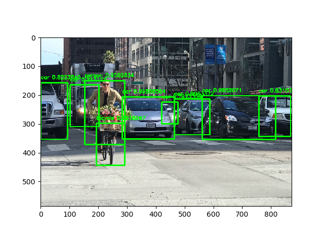
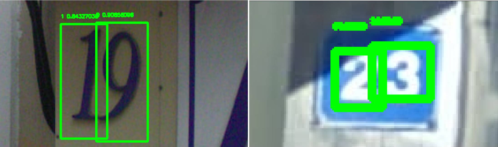

[](https://travis-ci.org/penny4860/tf-eager-yolo3) [](https://codecov.io/gh/penny4860/tf-eager-yolo3)


# Yolo-v3 using tensorflow eager

I have implemented yolo-v3 detector using tensorflow eager execution.



## Usage for python code

#### 0. Requirement

* python 3.6
* anaconda 5.1.0
* tensorflow 1.9.0
* opencv 3.4.3.18
* imgaug 0.2.6
* tqdm
* Etc.


I recommend that you create and use an anaconda env that is independent of your project. You can create anaconda env for this project by following these simple steps. This process has been verified on Windows 10 and ubuntu 16.04.

```
$ conda create -n yolo3 python=3.6 anaconda=5.1.0
$ activate yolo3 # in linux "source activate yolo3"
(yolo) $ pip install tensorflow==1.9.0
(yolo) $ pip install opencv-python==3.4.3.18
(yolo) $ pip install imgaug==0.2.6
(yolo) $ pip install tqdm
(yolo) $ pip install pytest-cov
(yolo) $ pip install codecov
(yolo) $ pip install -e .
```

### 1. Object detection using original yolo3-weights


* Run object detection through the following command.
	* ```project/root> python pred.py -c configs/predict_coco.json -i tests/samples/sample.jpeg```
	* Running this script will download the [original yolo3-weights file](https://pjreddie.com/media/files/yolov3.weights) and display the object detection results for the input image.
	
* You can see the following results:
	*  

### 2. Training from scratch

This project provides a way to train a detector from scratch. If you follow the command below, you can build a digit detector with just two images. If you follow the instructions, you can train the digit detector as shown below.

* ```project/root> python train_eager.py -c configs/predict_coco.json -i tests/samples/sample.jpeg```



Now you can add more images to train a digit detector with good generalization performance.

## Copyright

* See [LICENSE](LICENSE) for details.

